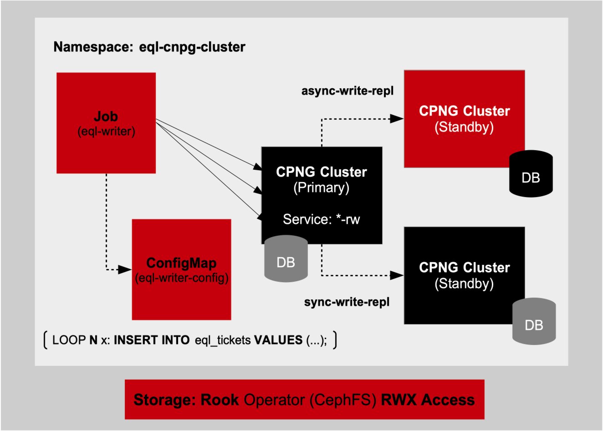

# CloudNativePG Postgres HA and Rook Ceph 

This Git repository provides provisioning and configuration for CloudNativePG Postgres in HA for Kubernetes with the add-on Rook CephFS Operator Filesystem Orchestrator. This Git repository will include HA failover workflows to force-fail the CNPG database.

## Prerequsites

- CloudNativePG Postgres Kubernetes Operator installation
- Rook Ceph Orchestrator Kuberetes Operator installation
- Sealed Secrets Controller for Kubernetes (Auto-Secret Rotation Not-Required ONLY)


## Provisioning Rook Ceph

To add and install the Helm Chart.

```shell
helm repo add rook-release https://charts.rook.io/release
helm repo update
```

To install using a `dry-run`
```shell
helm install rook-ceph rook-release/rook-ceph --namespace rook-ceph --create-namespace --dry-run
```

To install without the dry-run.

```shell
helm install rook-ceph rook-release/rook-ceph --namespace rook-ceph --create-namespace
``` 

## Provisioning Sealed Secrets Controller

To add and install the Helm Chart.
```shell
helm repo add sealed-secrets https://bitnami-labs.github.io/sealed-secrets
helm repo update
```

To install using a `dry-run`.
```shell
helm install sealed-secrets sealed-secrets/sealed-secrets \
  --namespace sealed-secrets \
  --set fullnameOverride=sealed-secrets-controller --create-namespace --dry-run
```

To install without the dry-run.
```shell
helm install sealed-secrets sealed-secrets/sealed-secrets \
  --namespace sealed-secrets \
  --set fullnameOverride=sealed-secrets-controller --create-namespace
```


## Provisioning CloudNativePG

To add and install the Helm Chart.

```shell
helm repo add cloudnative-pg https://cloudnative-pg.io/charts/
helm repo update
```

To install using a `dry-run`
```shell
helm install eql-cloudnativepg cloudnative-pg/cloudnative-pg \
--namespace cnpg-database -f cloudnative-pg-chart-values/cnpg-override-values.yaml \
--version 0.22.0 --create-namespace --dry-run
```

To install without the dry-run.

```shell
helm install eql-cloudnativepg cloudnative-pg/cloudnative-pg \
--namespace cnpg-database -f cloudnative-pg-chart-values/cnpg-override-values.yaml \
--version 0.22.0 --create-namespace
``` 

NOTES on deletion for re-install.

Delete the following.

Delete the existing `MutatingWebhookConfiguration` 
```shell
kubectl delete mutatingwebhookconfiguration cnpg-mutating-webhook-configuration
```
and 

Delete the existing `ValidatingWebhookConfiguration` 
```shell
kubectl delete mutatingwebhookconfiguration cnpg-mutating-webhook-configuration
```


## Install CloudNativePG HA Cluster and ConfigMap SQL Schema

To do a pre-flight pre-render using `helm template` do the following.

```shell
helm template eql-cloudnativepg-cluster . \
--namespace eql-cnpg-cluster \
--version 1.0.0 -f cnpg-cluster-override-values.yaml
```

To install the EQL CloudNative HA Cluster and EQL SQL Schema ConfigMap
To install without the dry-run.

```shell
helm install eql-cloudnativepg-cluster . \
--namespace eql-cnpg-cluster \
--version 1.0.0 -f cnpg-cluster-override-values.yaml --create-namespace
``` 

To apply changes to the Helm Chart and do upgrade lifecycles.

```shell
helm upgrade eql-cloudnativepg-cluster . \
--namespace eql-cnpg-cluster \
--version 1.0.0 -f cnpg-cluster-override-values.yaml
```

To get activity status of the deployed CloudNativePG cluster using the CNPG Kubernetes CLI plugin `cnpg`.

```shell
kubectl cnpg status  -n eql-cnpg-cluster
```

To uninstall the Helm chart.

```shell
helm uninstall eql-cloudnativepg-cluster --namespace eql-cnpg-cluster
```


## Pre-Flight Check Connection to the Cluster EQL Database

From the one of the CloudNativePG Cluster pods connect to the EQL database providing (non-production) username and password credentials.

Finding the Postgres `pg_hba.conf` on any of the Cluster pods after exec into the Pod to qualify connection config.

```shell
find / -name "pg_hba.conf" 2>/dev/null
```

Do cat of the pg_hba.conf file in the path returned as.
```shell
cat /var/lib/postgresql/data/pgdata/pg_hba.conf
```

The `pg_hba.conf` should look as follows.

```shell
#
# FIXED RULES
#

# Grant local access ('local' user map)
local all all peer map=local

# Require client certificate authentication for the streaming_replica user
hostssl postgres streaming_replica all cert
hostssl replication streaming_replica all cert
hostssl all cnpg_pooler_pgbouncer all cert

#
# USER-DEFINED RULES
#

host    eql    eql    0.0.0.0/0    md5
host    all    all    ::/0         md5

#
# DEFAULT RULES
#
host    all    all    all         scram-sha-256  # turn on as default for non-prod testing
```

In the chart values yaml file the section according to CloudNativePG docs to configure the `pg_hba.conf` is shown.

```yaml
postgresql:
    ...
    pg_hba:
    {{- range .Values.cloudNativePG.postgresql.pg_hba }}
      - {{ . }}
    {{- end }}
```

The corresponding values yaml file is shown here.

```yaml
postgresql:
    ...
    pg_hba:
      - host    all    all    0.0.0.0/0    md5
      - host    all    all    ::/0         md5
      - host    all    all    all          md5
```

The preceding configuration is for non-prod and for production should use TLS certificates.

To test the connection to any of the CloudNativePG Cluster pods and issue a `\dt` to show all EQL datbase tables.

```shell
kubectl exec -it <pod-name> -n cluster-deploy-sql -- /bin/bash
PGPASSWORD=<apppassword> psql -U <appusername> -d eql
```

This (if working) should show a `psql` prompt to issue the `\dt` command.

or

```shell
kubectl exec -it <pod-name> -n cluster-deploy-sql -- /bin/bash
PGPASSWORD=<apppassword> psql -U <appusername> -d eql -c "SELECT 1;"
```


## In-Cluster CNPG SQL Traffic Writers 

The Git repository provides two In-Cluster CNPG Cluster Load Runners to write to the Cluster `primary` replica through the `eql-storage-postgresql-cluster-rw` Kubernetes `Service` proxying the Cluster Pods. This Service guarantees all SQL writes go through to the `primary` and all streaming-replication of data is streamed down to the `standbys`. Of the two standby replcas, one is written to synchronously for guaranteed replication and the second one is written to asynchronously for speed considerations.  

For the traffic writers, their designed as a Kubernetes `Job` and their Job parameters are separated into a Kubernetes `ConfigMap` to allow extension separately from the Job resource. The following prerequisites are requied for the Job to work.





- Pre-existing CNPG Cluster Deploy and CNPG Cluster User-Level Secret 

There are four versions of the Job. 

- Version No-Ddosify writing to EQL Lottery Games Scaled-Down (Quick Validate) DB
- Version No-Ddosify writing to EQL Lottery Games DB
- Version Ddosify writing to EQL Lottery Games (Quick Validate) Scaled-Down DB
- Version Ddosify writing to EQL Lottery Games DB


`Ddosify` (now `Anteon`) is a HTTP/HTTPS Traffic Generator to send traffic load to a target service. It provides concurrency flags and timing intervals to provide traffic requests into the target service at-scale. Ddosify does NOT talk SQL directly and in-order to configure a Kubernetes Job that includes Ddosify container image, it requires a proxy service container image that intercepts the HTTP/HTTPS traffic request and provide a gateway to redirect the requests as SQL requests to the CNPG Cluster. The Job in-order to talk SQL uses the Postgres client image to connect to the CNPG Cluster. The Job Pod contains three container images.


- Postgres Client container image
- Ddosify Service container image
- Postgres Proxy Service container image (Go*, Rust)   * default to Go and Go sqlx


### EQL Lottery Games Scaled-Down DB Schema

The provided `eql-schema-scaled-down.sql` schema file is provided to create the CNPG Cluster database for validation of deployed Helm Chart resources IF and ONLY IF the official `eql-schema.sql` schema is down for changes and additional CNPG Cluster changes occurr separately. 

The following is the schema for this.

```sql
-- Ensure the pgcrypto extension is enabled for UUID generation
CREATE EXTENSION IF NOT EXISTS "pgcrypto";

-- Create `eql_games` table
CREATE TABLE eql_games (
    game_id UUID PRIMARY KEY DEFAULT gen_random_uuid(),
    game_name VARCHAR(100) NOT NULL,
    start_time TIMESTAMP WITHOUT TIME ZONE NOT NULL,
    end_time TIMESTAMP WITHOUT TIME ZONE,
    status VARCHAR(50) NOT NULL
);

-- Index on `game_name` to speed up queries by game name
CREATE INDEX idx_game_name ON eql_games (game_name);

-- Index on `status` to speed up status-based queries
CREATE INDEX idx_game_status ON eql_games (status);

-- Create `eql_game_tickets` table
CREATE TABLE eql_game_tickets (
    ticket_id UUID PRIMARY KEY DEFAULT gen_random_uuid(),
    game_id UUID NOT NULL,
    purchase_time TIMESTAMP WITHOUT TIME ZONE NOT NULL,
    player_id UUID NOT NULL,
    ticket_number VARCHAR(20) UNIQUE NOT NULL,
    status VARCHAR(50) NOT NULL,
    prize_amount NUMERIC,
    FOREIGN KEY (game_id) REFERENCES eql_games (game_id) ON DELETE CASCADE
);

-- Index on `game_id` for faster joins and lookups by game
CREATE INDEX idx_ticket_game_id ON eql_game_tickets (game_id);

-- Index on `player_id` for faster joins and lookups by player
CREATE INDEX idx_ticket_player_id ON eql_game_tickets (player_id);

-- Create `eql_game_players` table
CREATE TABLE eql_game_players (
    player_id UUID PRIMARY KEY DEFAULT gen_random_uuid(),
    player_name VARCHAR(100) NOT NULL,
    email VARCHAR(100) UNIQUE,
    join_date TIMESTAMP WITHOUT TIME ZONE DEFAULT CURRENT_TIMESTAMP
);

-- Index on `player_name` to speed up searches by player name
CREATE INDEX idx_player_name ON eql_game_players (player_name);

-- Create `eql_game_player_rankings` table
CREATE TABLE eql_game_player_rankings (
    ranking_id UUID PRIMARY KEY DEFAULT gen_random_uuid(),
    player_id UUID NOT NULL,
    game_id UUID NOT NULL,
    ranking INTEGER NOT NULL,
    points NUMERIC,
    FOREIGN KEY (player_id) REFERENCES eql_game_players (player_id) ON DELETE CASCADE,
    FOREIGN KEY (game_id) REFERENCES eql_games (game_id) ON DELETE CASCADE
);

-- Index on `player_id` to speed up joins and lookups by player in rankings
CREATE INDEX idx_ranking_player_id ON eql_game_player_rankings (player_id);

-- Index on `game_id` for faster joins with games in the rankings table
CREATE INDEX idx_ranking_game_id ON eql_game_player_rankings (game_id);


-- ALTER TABLE and GRANT PRIVLEGES statements for eql_games

-- Run this as the postgres user to transfer ownership of all tables to eql:
ALTER TABLE eql_games OWNER TO eql;
ALTER TABLE eql_game_tickets OWNER TO eql;
ALTER TABLE eql_game_players OWNER TO eql;
ALTER TABLE eql_game_player_rankings OWNER TO eql;

-- As postgres, grant privileges:
GRANT ALL PRIVILEGES ON ALL TABLES IN SCHEMA public TO eql;
GRANT ALL PRIVILEGES ON ALL SEQUENCES IN SCHEMA public TO eql;
GRANT ALL PRIVILEGES ON DATABASE eql TO eql;


-- Insert a game into `eql_games`
INSERT INTO eql_games (game_name, start_time, end_time, status)
VALUES ('Poker Train', '2024-11-01 10:00:00', '2024-11-01 22:00:00', 'active');

-- Insert a player into `eql_game_players`
INSERT INTO eql_game_players (player_name, email, join_date)
VALUES ('Count Dracula', 'countdracula@transylvanians.com', '2024-11-01 09:30:00');

-- Insert a ticket for the game and player into `eql_game_tickets`
INSERT INTO eql_game_tickets (game_id, purchase_time, player_id, ticket_number, status, prize_amount)
VALUES (
    (SELECT game_id FROM eql_games WHERE game_name = 'Poker Train'),  -- Linking to the created game
    '2024-11-01 10:15:00',
    (SELECT player_id FROM eql_game_players WHERE player_name = 'Count Dracula'),  -- Linking to the created player
    'TICKET12345',
    'pending',
    100.50
);

-- Insert a ranking for the player in the game into `eql_game_player_rankings`
INSERT INTO eql_game_player_rankings (player_id, game_id, ranking, points)
VALUES (
    (SELECT player_id FROM eql_game_players WHERE player_name = 'Count Dracula'),
    (SELECT game_id FROM eql_games WHERE game_name = 'Poker Train'),
    1,
    1500
);
```


### No-Ddosify-EQL Lottery Games Scaled-Down DB Chart


To do a pre-flight pre-render using `helm template` do the following.

```shell
helm template no-ddosify-cnpg-cluster-writer-scaled-down . \
--namespace eql-cnpg-cluster \
--version 1.0.0 
```

To install without the dry-run.

```shell
helm install no-ddosify-cnpg-cluster-writer-scaled-down . \
--namespace eql-cnpg-cluster \
--version 1.0.0
``` 

To apply changes to the Helm Chart and do upgrade lifecycles.

```shell
helm upgrade no-ddosify-cnpg-cluster-writer-scaled-down . \
--namespace eql-cnpg-cluster \
--version 1.0.0
```

To get activity status of the deployed CloudNativePG cluster using the CNPG Kubernetes CLI plugin `cnpg`.

```shell
kubectl cnpg status  -n eql-cnpg-cluster
```

To uninstall the Helm chart.

```shell
helm uninstall no-ddosify-cnpg-cluster-writer-scaled-down --namespace eql-cnpg-cluster
```


## In-Cluster CNPG Cluster Chaos Engineering (Primary Replica Shutdown)  

In order to add disruption to the existing CNPG Cluster and shutdown the CNPNG Cluster `primary` Pod the to add this offering with HA provided configurations, the Kubernetes Cluster requires the installation of CNCF `Chaos Mesh` Helm Chart. The workflow will provide a Chaos Mesh `PodChaos` resource to disrupt the CNPG Cluster Postgres `primary` Pod and allow the synchronous `standby` leader-election as the new primary do continue DB transaction writes at the point of primary shutdown. The new primary will serve the role as the old primary transitions to the new synchronous replica standby. 

Installing the prerequisite `Chaos Mesh` Helm Chart.

Add the Chaos Mesh Helm Chart Repository to the Kubernetes Cluster.

```shell
helm repo add chaos-mesh https://charts.chaos-mesh.org
helm repo update
```

To install the Chaos Mesh Helm Chart.

```shell
helm install chaos-mesh chaos-mesh/chaos-mesh -n chaos-mesh --create-namespace
```

The Chaos Mesh referencing `PodChaos` templated resource to shutdown the CNPG Cluster `primary` is configured as follows.

```yaml
apiVersion: chaos-mesh.org/v1alpha1
kind: PodChaos
metadata:
  name: {{ .Release.Name }}-pod-shutdown
  namespace: {{ .Values.targetNamespace }}
  labels:
    app.kubernetes.io/managed-by: "Helm"
spec:
  action: {{ .Values.podChaos.action }}
  mode: {{ .Values.podChaos.mode }}
  duration: {{ .Values.podChaos.duration }}
  selector:
    namespaces:
      {{- toYaml .Values.podChaos.selector.namespaces | nindent 6 }}
    labelSelectors:
      {{- toYaml .Values.podChaos.selector.labelSelectors | nindent 6 }}
  scheduler:
    cron: "@every 1m"  # Adjust schedule to run periodically
```

The corresponding `values.yaml` for the `PodChaos` resource is as follows.

```yaml
# Namespace where the CNPG cluster is deployed
targetNamespace: eql-cnpg-cluster-projvol

# Chaos parameters
podChaos:
  action: "pod-kill"       # Type of disruption, e.g., "pod-kill"
  mode: "one"              # Chaos mode (e.g., "one" to select one pod, "all" for all pods, or specific percentage)
  duration: "30s"          # Duration for which the chaos is applied (useful for testing)
  selector:
    namespaces:
      - eql-cnpg-cluster-projvol
    labelSelectors:
      "app": "eql-storage-postgresql-cluster"  # Target label for the CNPG cluster pods
```

To pre-render the Helm Chart pre-deploy step do the following.

```shell
helm template cpng-cluster-pod-shutdown-scaled-down ./cpng-cluster-pod-shutdown-scaled-down --namespace eql-cnpg-cluster-projvol
```

To install the Helm Chart.

```shell
helm install cpng-cluster-pod-shutdown-scaled-down ./cpng-cluster-pod-shutdown-scaled-down --namespace eql-cnpg-cluster-projvol
```

To upgrade the Helm Chart.

```shell
helm upgrade cpng-cluster-pod-shutdown-scaled-down ./cpng-cluster-pod-shutdown-scaled-down --namespace eql-cnpg-cluster-projvol
```

To uninstall the Helm Chart.

```shell
helm uninstall cpng-cluster-pod-shutdown-scaled-down --namespace eql-cnpg-cluster-projvol
```


## Disaster Recovery and Restoration 


In-Progress 


## References

Ddosify (now Anteon) `https://github.com/getanteon/anteon`