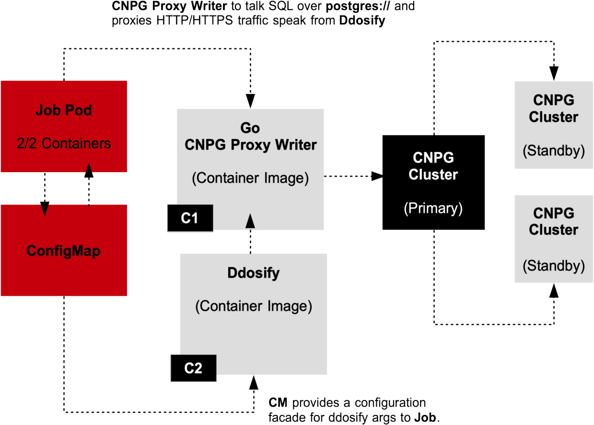

## CNPG Proxy Writer (Go) Service

This proxy service is required to work in coordination with `ddosify` traffic load generator.

Ddosify controls the client counts, concurrency rate and timing invertals of the traffic sent to the target service. Ddosify does NOT talk SQL directly and requires a proxy service to triangulate the its traffic configuration to CNPG Cluster. This CNPG proxy service talks directly to the CNPG Cluster as it holds the Postgres connection DSN, provides the Postgres table associations and provides the API handlers to write across a range of CNPG Cluster tables. 

See the following workflow architecture for how this works.

This architectural workflow is only required for Kubernetes `Jobs` serving as a sentry service. The coordination from the proxy service and CNPG Cluster requires only `ClusterIP` access. This does not require the service to run with an associated Gateway resource (Gateway API `Gateway` reource or Istio `Gateway` resouce) and a routing resource (Gateway API `HTTPRoute` or Istio `VirtualService`). 

If CNPG Proxy Writer requires traffic orginating external to the Kubernetes Cluster, the Gateway API `Gateway` reource or Istio `Gateway` resouce) and a routing resource (Gateway API `HTTPRoute` or Istio `VirtualService`) are required. 

